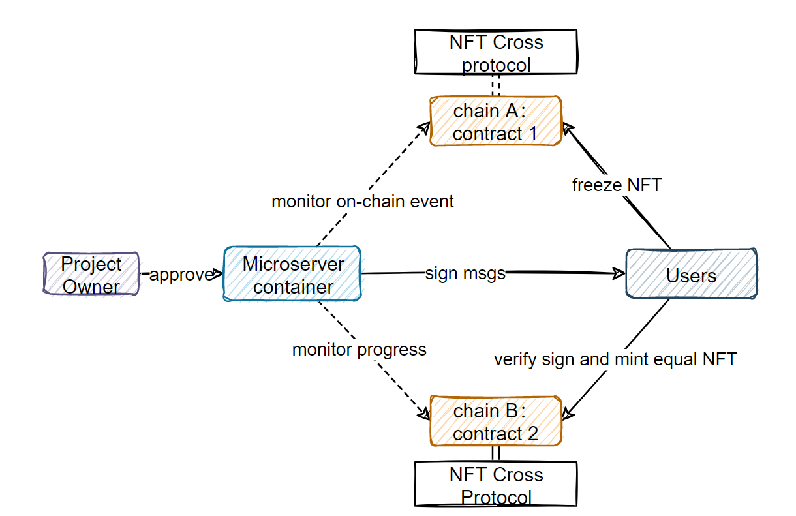
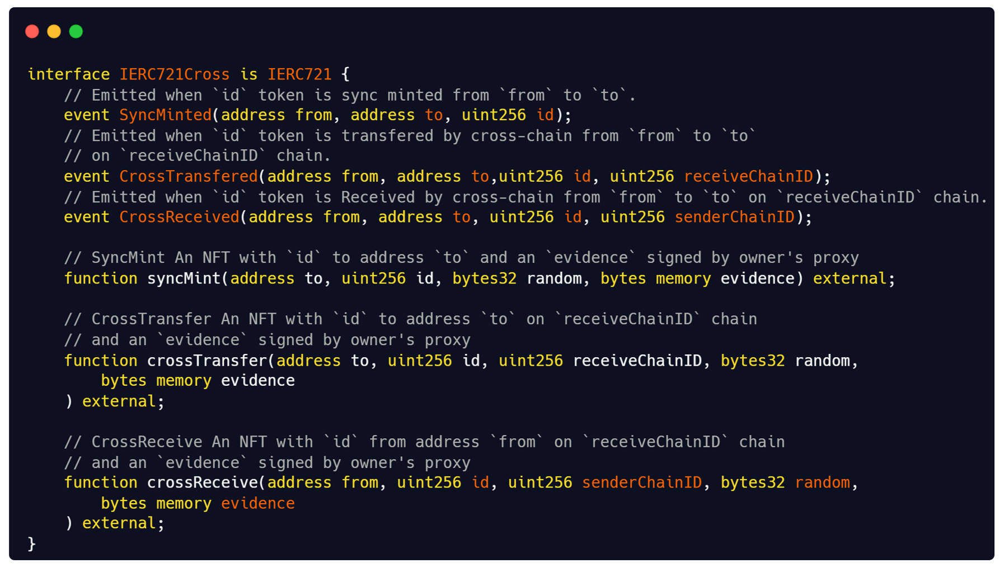

# Middleware.web3
This is an opensource bridge used for multi-chain NFT deployment. 
## Features 
- Individual NFT asset on multichain.
- Cross chain transfer with admin's approve.
## Sturcture
The scheme sturcture of our system is shown as below:

## Interface
The cross-chain smart contract interface design as below:

## Milestones
- [x] System structure design 
- [x] Smartcontract development
- [x] Gin backend development
- [ ] Micro-server container development 
- [ ] Project owner admin panel
- [ ] User cross-chain transfer interface
## Teams
**Fx Xie**
- Micro-server and backend development
- https://github.com/xiezhaochu
- bigwolfdog.eth

**Pine Duan**
- Frontend and UX
- https://github.com/PineDuan

**Box** 
- On-chain data analysis
- https://github.com/nishuzumi
- boxchen.eth

**Lindle**
- Product management

**Sanchuan**

- Smart Contract development 
- https://github.com/liusanchuan

